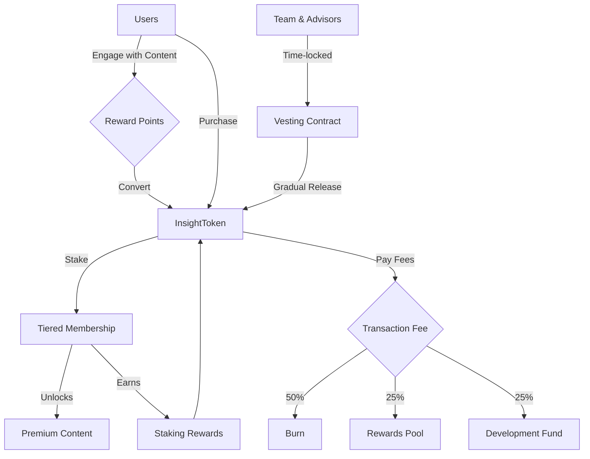
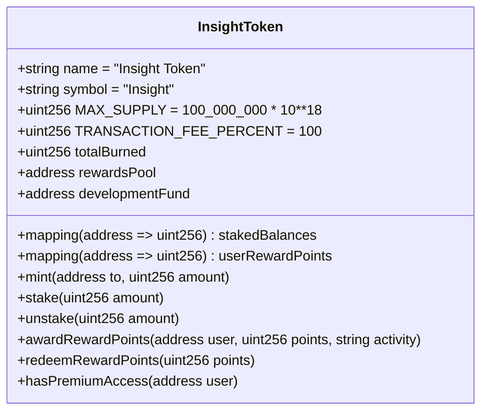
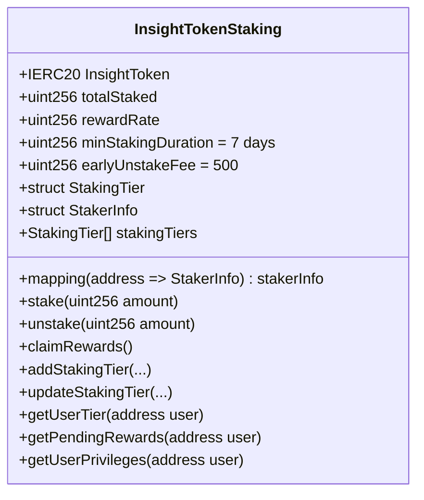
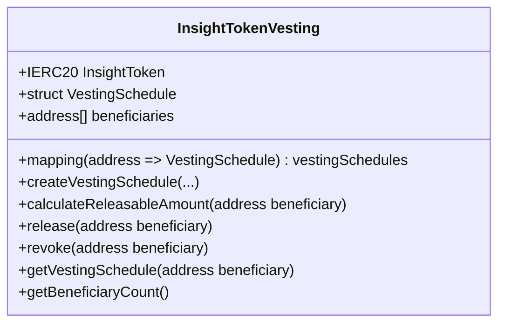
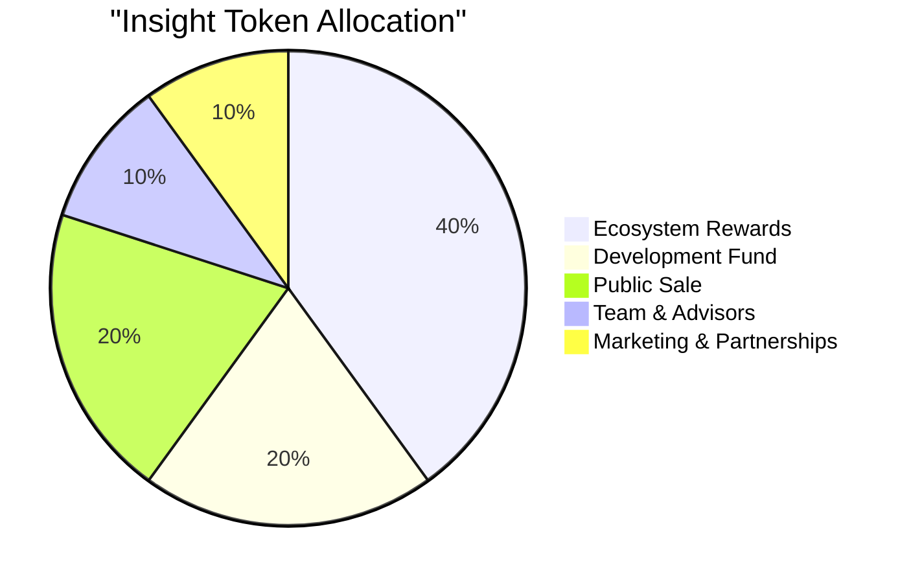
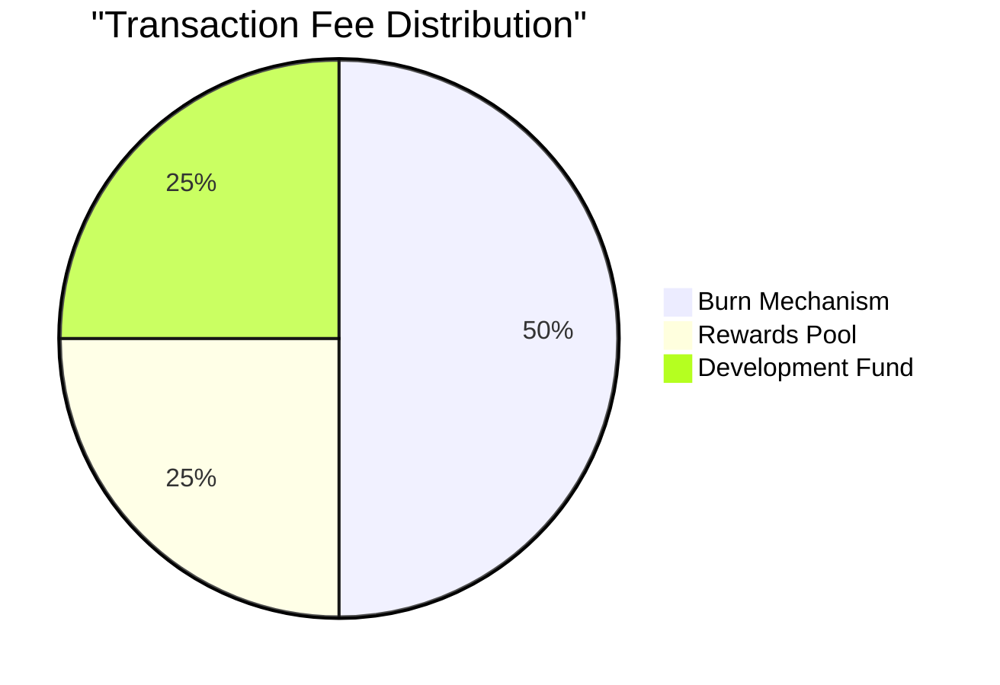

# Insight Token Platform Documentation

## Project Overview

This document provides comprehensive documentation for the Insight Token Platform, a blockchain-based tokenomics solution for content monetization. The platform was developed based on the client's specifications for creating a token-based ecosystem that rewards content creation, engagement, and curated learning experiences.
## Frontend Implementation

A complete frontend application has been developed for this platform, allowing users to interact with the contracts through an intuitive interface. The frontend enables token staking, tier management, reward claiming, and content access control in a seamless user experience.

📱 **Live Demo Video**: Soon


💻 **Frontend Repository**: [https://github.com/jmakwana01/Staking-utility-ecosystem-smart-contract](https://github.com/jmakwana01/Staking-utility-ecosystem-smart-contract)

## Core Requirements Implemented

The client requested a token-based monetization system with the following key requirements:

1. A utility token with embedded fee mechanisms to ensure sustainability
2. A tiered membership system to reward token staking
3. A points-based reward system for user engagement
4. Secure token management for team allocations with time-controlled release
5. A comprehensive token distribution plan following the 40/20/20/10/10 model


## Core Contracts

### InsightToken.sol

The core ERC-20 token with built-in fee mechanisms, staking capabilities, and reward points system.



### InsightTokenStaking.sol

An advanced staking contract with tiered membership and reward multipliers.



### InsightTokenVesting.sol

A vesting contract for secure team and advisor token allocations.


## Technical Implementation

### InsightToken.sol

The core token contract implements:

- **ERC-20 Standard Compliance**: Full compatibility with wallets and exchanges
- **Built-in Fee Mechanism**: 1% transaction fee with specific allocation rules:
  - 50% burned (deflationary pressure)
  - 25% to rewards pool (ecosystem sustainability)
  - 25% to development fund (ongoing improvements)
- **Maximum Supply**: 100 million tokens with 18 decimals
- **Basic Staking**: Integrated staking functionality for premium access
- **Reward Points System**: Award and redemption mechanisms for platform engagement
- **Role-Based Access Control**: Admin, minter, and pauser roles for secure management
- **Pausing Functionality**: Emergency pause capability for critical situations

Key implementation details:
```solidity
function _update(address from, address to, uint256 amount) internal override whenNotPaused {
    // Fee mechanism logic
    if (from != address(0) && to != address(0) && from != address(this) && to != address(this)) {
        uint256 fee = (amount * TRANSACTION_FEE_PERCENT) / 10000;
        if (fee > 0) {
            // Calculate and apply distribution
            uint256 burnAmount = (fee * BURN_RATIO) / 100;
            uint256 rewardsAmount = (fee * REWARDS_RATIO) / 100;
            uint256 developmentAmount = (fee * DEVELOPMENT_RATIO) / 100;
            
            // Apply distributions
            super._update(from, address(0), burnAmount);
            super._update(from, rewardsPool, rewardsAmount);
            super._update(from, developmentFund, developmentAmount);
            
            totalBurned += burnAmount;
            emit FeeDistributed(burnAmount, rewardsAmount, developmentAmount);
            amount -= fee;
        }
    }
    super._update(from, to, amount);
}
```

### InsightTokenStaking.sol

The advanced staking contract delivers:

- **Multi-tier Membership System**: Three initial tiers with different benefits
  - Basic Tier (100 tokens): Premium content access
  - Silver Tier (500 tokens): Adds exclusive webinars access
  - Gold Tier (1000 tokens): Adds priority support
- **Reward Multipliers**: Increased rewards based on tier (1.0x, 1.2x, 1.5x)
- **Dynamic Tier Assignment**: Automatic tier calculation based on staked amount
- **Early Unstaking Fee**: 5% fee for unstaking before minimum duration (7 days)
- **Extensible Design**: Admin functions to add or modify tiers
- **Time-based Reward Calculations**: Fair reward distribution based on staking duration

The staking reward calculation uses:
```solidity
function _updateRewards(address user) internal {
    if (stakerInfo[user].stakedAmount == 0) {
        return;
    }
    
    uint256 timeElapsed = block.timestamp - stakerInfo[user].lastClaimTimestamp;
    if (timeElapsed > 0) {
        uint256 baseRewards = (stakerInfo[user].stakedAmount * rewardRate * timeElapsed) / 1e18;
        
        // Apply tier multiplier
        uint256 tierMultiplier = stakingTiers[stakerInfo[user].stakingTier].rewardMultiplier;
        uint256 rewards = (baseRewards * tierMultiplier) / 10000;
        
        stakerInfo[user].accumulatedRewards += rewards;
        stakerInfo[user].lastClaimTimestamp = block.timestamp;
    }
}
```

### InsightTokenVesting.sol

The vesting contract enables:

- **Time-locked Token Release**: Secure token distribution to team and advisors
- **Customizable Vesting Parameters**:
  - Cliff period (time before any tokens are released)
  - Vesting duration (total time until all tokens are released)
  - Revocable option (for team departures)
- **Linear Release**: Gradual token unlocking after cliff period
- **Beneficiary Management**: Multi-beneficiary support with individual schedules
- **Transparent Tracking**: Functions to monitor vesting progress and available tokens

The vesting calculation algorithm:
```solidity
function calculateReleasableAmount(address beneficiary) public view returns (uint256) {
    VestingSchedule storage schedule = vestingSchedules[beneficiary];
    
    if (schedule.totalAmount == 0 || schedule.revoked) {
        return 0;
    }
    
    if (block.timestamp < schedule.startTime + schedule.cliffDuration) {
        return 0;
    }
    
    if (block.timestamp >= schedule.startTime + schedule.vestingDuration) {
        return schedule.totalAmount - schedule.amountReleased;
    }
    
    uint256 timeFromStart = block.timestamp - schedule.startTime;
    uint256 vestedAmount = (schedule.totalAmount * timeFromStart) / schedule.vestingDuration;
    
    return vestedAmount - schedule.amountReleased;
}
```

## Token Economics Implementation

The tokenomics model follows the client's 40/20/20/10/10 distribution plan:

The fixed supply of 100 million Insight tokens is distributed as follows:


- **40% Ecosystem Rewards**: Initial allocation to reward pool for user incentives
- **20% Development Fund**: Allocation for ongoing development and improvements
- **20% Public Sale**: Reserved for initial token sale and fundraising
- **10% Team & Advisors**: Allocated to team with vesting schedules
- **10% Marketing**: Reserved for marketing initiatives and partnerships

This distribution is implemented in the token contract constructor and deployment scripts:

```solidity
// Initial token distribution in constructor
// 40% to ecosystem rewards
_mint(rewardsPool, (MAX_SUPPLY * 40) / 100);

// 20% to development fund
_mint(developmentFund, (MAX_SUPPLY * 20) / 100);

// Remaining distribution handled during deployment
```
### Transaction Fee Distribution

Every token transfer includes a 1% fee, distributed as:



### Membership Tiers

| Tier | Minimum Stake | Multiplier | Benefits |
|------|---------------|------------|----------|
| **Basic** | 100 Insight | 1.0x | Premium content access |
| **Silver** | 500 Insight | 1.2x | Basic benefits + exclusive webinars |
| **Gold** | 1000 Insight | 1.5x | Silver benefits + priority support |

## Integration Testing

Comprehensive integration tests verify the entire system works together as expected:

1. **User Journey Simulation**: Tests the complete lifecycle from token acquisition to staking and rewards
2. **Token Distribution Verification**: Ensures the correct token allocation across all components
3. **Fee Mechanism Validation**: Confirms fee collection, burning, and redistribution work correctly
4. **Staking Tier Progression**: Tests tier upgrades as users stake more tokens
5. **Vesting Schedule Execution**: Verifies token release schedules function according to parameters

The testing approach ensures:
- All user flows work as intended
- Edge cases are handled appropriately
- Transaction fees are applied correctly
- Token balances reconcile across the system

## Security Considerations

Multiple security mechanisms have been implemented:

- **AccessControl**: Role-based permissions for administrative functions
- **ReentrancyGuard**: Protection against reentrancy attacks
- **Pausable**: Emergency pause functionality
- **Input Validation**: Comprehensive parameter checking
- **SafeERC20**: Secure token transfer handling

## Design Decisions and Rationale

### Fee Implementation Strategy

The 1% transaction fee is implemented in the `_update` function rather than in `_transfer` because:
1. `_update` is the OpenZeppelin recommended override point in ERC20 v5+
2. It properly handles both direct transfers and transferFrom operations
3. It provides a single consistent point for fee application
4. It properly calculates fee distribution with minimal gas consumption

### Staking Architecture

The staking system uses a separate contract rather than fully integrating it into the token contract because:
1. It maintains cleaner separation of concerns
2. It allows for future upgrades to the staking mechanism without affecting the token
3. It provides more flexibility for tier management
4. It enables more complex reward calculations

### Vesting Implementation

The vesting contract uses a linear vesting approach after cliff because:
1. It provides a fair and predictable token release schedule
2. It's industry standard for team and advisor allocations
3. It's gas-efficient for calculating releasable amounts
4. It supports both fully vested and partial vesting scenarios

## Deployment Instructions

The system should be deployed in the following order:

1. Deploy InsightToken with appropriate reward pool and development fund addresses
2. Deploy InsightTokenVesting targeting the deployed token
3. Deploy InsightTokenStaking targeting the deployed token
4. Transfer tokens to vesting contract and create schedules
5. Set up initial reward parameters for staking contract

## Contract Addresses (Polygon Mainnet)

- InsightToken: [Contract to be deployed]
- InsightTokenStaking: [Contract to be deployed]
- InsightTokenVesting: [Contract to be deployed]

# Staking-utility-ecosystem-smart-contract
